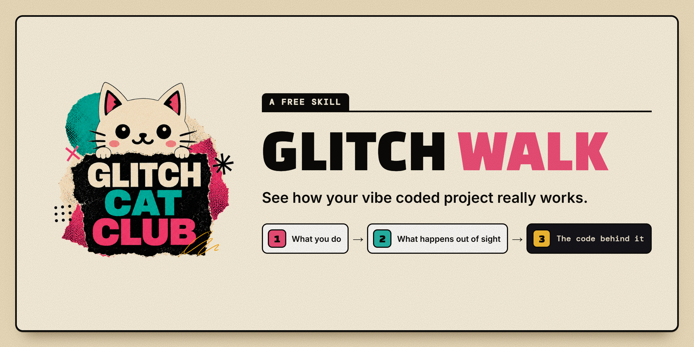

# Glitch Walk

**Code is hard to read. If you vibe coded yours, you have probably never read it.**

Glitch Walk is a learning tool for vibe coders.
Ask how one part of your project works and it shows you: the real screens, every step in order and the code behind each one.

<!-- the clip of a real walk goes here -->

Nothing is dumbed down and nothing is made up.
Once you can see how it works, you can ask your AI far better questions about it.

This is a work in progress that I wanted to share.
Updates will follow.

## Ask anything

Every question fits one of seven shapes.

1. What happens when I do this?
2. What is this part doing?
3. How does this whole thing work?
4. Why did that happen?
5. What does this on my screen mean?
6. Explain this idea, in my system.
7. What changed?

## It only looks

It never fixes, changes, sends or signs in to anything.
Where it could not check something, the page says so.

## Set it up

You need Claude Code or Codex, [uv](https://docs.astral.sh/uv/) and Chrome.
Copy the `glitch-walk` folder into your tool's skills folder, open your project and ask.

## Make it your own

This is a method as much as a tool and every part is yours to change.

| File | What it holds |
|---|---|
| `SKILL.md` | The instructions your AI tool follows. |
| `src/start.py` | The seven steps that turn any question into one thing to walk and every word you are told on the way. |
| `src/capture.py` | Takes each picture and measures where every part sits on it. |
| `src/build.py` | Reads the code from your files, checks the walk against the rules and writes the page. |
| `src/story.js`, `src/story.css` | Draw the page. |
| `tests/` | The tests and a tool that opens a finished page and reports anything drawn wrongly. |

Change the words in `src/start.py` and every walk says your words.
Change `src/story.css` and every page takes your look.
